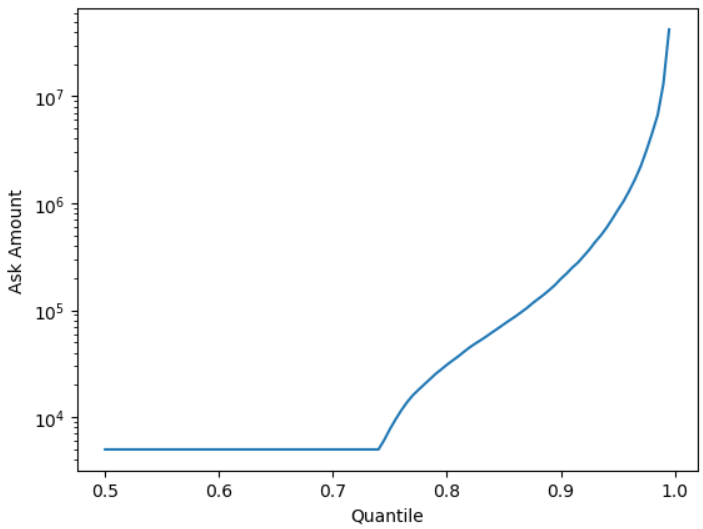
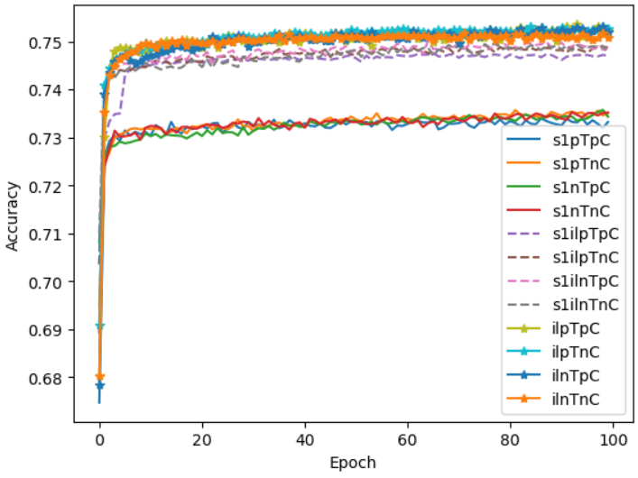
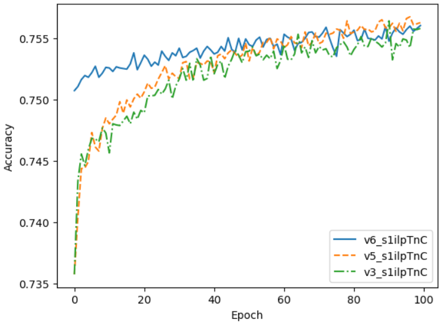

# Neural Network Charity Challenge

## Introduction 

From Alphabet Soup’s business team, Beks received a CSV containing more than 34,000 organizations that have received funding from Alphabet Soup over the years. Within this dataset are a number of columns that capture metadata about each organization. Our goal here is to create a neural network binary classifier that is capable of predicting whether applicants will be successful if funded by Alphabet Soup.  

## First Network

This code can be found in AlphabetSoupCharity.ipynb, along with discussion throughout the code.

### Pre-processing  
The CSV contains the following columns:

- `EIN` and `NAME`: Identification columns  
- `APPLICATION_TYPE`: Alphabet Soup application type  
- `AFFILIATION`: Affiliated sector of industry  
- `CLASSIFICATION`: Government organization classification  
- `USE_CASE`:  Use case for funding  
- `ORGANIZATION`: Organization type  
- `STATUS`: Active status  
- `INCOME_AMT`: Income classification  
- `SPECIAL_CONSIDERATIONS`: Special consideration for application  
- `ASK_AMT`: Funding amount requested  
- `IS_SUCCESSFUL`: Was the money used effectively?  

First, the `EIN` and `NAME` columns are dropped. These are unique identifiers and, as such, can not be used to fit trends and predict outcomes.  

Application type, affiliation, classification, use case, organization, status, income amount, special considerations, and ask amount will all be treated as features to predict the target of whether or not the applicant charity was successful. 

Application type, affiliation, classification, use case, organization, income amount, and special considerations are categorical and will need to be one-hot encoded. Status and ask amount are numerical and will be used directly. (Of note, income amount was already binned into pre-existing groups, which is why it is treated categorically, rather than numerically.) To one-hot encode the categorical features, they need to be binned a little so there are just a handful of unique values, rather than the 17 application types and 71 classifications currently in the data.  

Application types follow a naming schema of T*x*, where *x* is a number with an unknown meaning to us. Without understanding more of the context, our binning choices are purely to balance the number of each type. We will combine all the application types with fewer than 500 counts into an 'other' category. To wit, the binned application types and number of applicants with that type are as follows:  
| Type | Count |
| :---: | :---: |
| T3 | 27037 | 
| T4 | 1542 | 
| T6 | 1216 | 
| T5 | 1173 | 
| T19 | 1065 | 
| T8 | 737 | 
| T7 | 725 | 
| T10 | 528 | 
| Other | 276 |  

We have moved from 17 unique application types to 9, which should aid model performance.  

The classification column schema is even more confusing with 71 unique classifications, of form C*x* with *x* being a 4-digit number (with one category, `C0`, that doesn't follow this schema). While the purposes of the numbers are somewhat obfuscated, we posit that those with the same thousands-place digit are of like kind (e.g. `C2000`, `C2100`, and `C2561` are all of a like C2- class). As such, we will bin together applications with the same thousands-place digit (e.g. all C2- above will be binned to `C2xxx`). The exceptions to this binning scheme are (1) C0 will remain on its own and (2) the `C1000` and `C1xxx` will remain separate because of the already-large number of `C1000` applicants and we want to keep the binning counts somewhat balanced. Following this schema, the classification bins and counts are,  

| Type | Count |  
| :---: | :---: |
| C1000 | 17326 | 
| C2xxx | 8205 | 
| C1xxx | 5567 | 
| C3xxx | 1921 | 
| C7xxx | 909 | 
| C4xxx | 203 | 
| C5xxx | 117 | 
| C8xxx | 32 | 
| C6xxx | 16 | 
| C0 | 3 |  

From 71 different classifications originally, we have now just 10.  

After those two steps, our categorical columns are ready for one-hot encoding. To this end, we use `scikit-learn`'s `OneHotEncoder` class. We re-combine these encoded categorical columns with our numerical columns listed above and then split off the features from the target (the `IS_SUCCESSFUL` column). Using `scikit-learn`'s `train_test_split` method, we split the data into training (75%) and testing/validation (25%) sets. We used a random state seed for consistenty and forewent stratification because the successful outcome classes are well-balanced (yes: 18,261; no: 16,038). `Scikit-learn`'s `StandardScaler` was used to scale the features. Column-wise, the scaler calculated the z-score on the training data and is applied to the training and testing data. Following that step, we are free to build out the neural network.  

### Model Creation  

`TensorFlow`'s `Sequential` paradigm was used to create a neural network with one input layer, one hidden layer, and one output layer.  

The choice of the number of neurons seen in the code is odd and requires some brief discussion. Previously in the module content, a general rule of num_neurons = num_inputs \* 2 (or 3), which worked well for the examples we did with 2 inputs and 6 neurons in a 1-layer model. A few pages later, a 30-input dataset example was worked through, with only 8 neurons in the input layer and 5 neurons in a second layer (with 1 neuron in an output layer). This schema "broke" the general rule and seemed to imply a sort of ceiling to neurons in a layer. Since an 8-5-1 schema worked well for the 30-input example and ours here is comprised of 48 examples with no good reason to choose another neuron schema, we went forward with an 8-5-1 schema. Since we would be working to optimize the network later, this seemed a fine first step.  

`Dense` class layers were chosen for the `Sequential` model. As noted, the number of neurons for the input layer was 8 with a `relu` activation function. There was one hidden layer of 5 neurons, also with a `relu` activation function. `Relu` activation functions were chosen for their robustness and a lack of complex understanding for choosing another function (indeed, a "throw stuff at the wall and see what sticks" method). Finally, an output layer with a single neuron and `sigmoid` activation function, since we have a binary outcome, was utilized. 

The network was compiled with a `binary_crossentropy` loss function and `adam` optimizer and tracked with a simple accuracy metric. The model was trained over 100 epochs with weights saved every 5 epochs in `./checkpoints/`. 

### Result 

The network plateaued during training with an accuracy of ~73% and loss metric of 0.55. The network was validated against the aforementioned 25% split of the data. On the testing data, the network achieved an accuracy of 72.4% and loss metric of 0.565, fairly consistent with the training data, though with room for improvement. The model was saved as `nn_nominal_deliverable2.h5`.

## Model Optimization 1

The following discussion follows AlphabetSoupCharity_Optimization.ipynb. Fair warning, it is **dense**. From discussions in the previous code, there are numerous, minute adjustments made in the pre-processing steps below. In an effort to see what matters and what doesn't, there were two dataframes created at [almost] each step: one with the previously attempted step applied and one with a new attempted step applied. The number of dataframes, encoders, scalers, and networks gets out of hand *quickly* (powers of two!), but each is labeled and it can be followed with care. 

There is plenty of discussion throughout the code, but we don't discuss it much herein because, ultimately, the effects were subtle and don't warrant much discussion.  

### Pre-processing

Again, the `EIN` and `NAME` columns are not conducive to machine learning and were dropped. This step is the same as previously.  

##### Change 1
The status column is used to reflect whether or not the charity is still operating. Only 5 of the 34,000 are no longer operating. While there isn't much there to confuse the neural network, we opt to remove the charities no longer in operation. Since each charity now has the same value for the status column, we drop the status column entirely. Moving forward, each dataframe that has this step applied is prepended by `step1` or `s1` (for short); those dataframes without this prefix contain the status column and full values.

##### Change 2
The asking amount for the charities warrants much discussion. While the majority of applicants (~75%) asked for $5,000, the max amount asked for was around $8.5 **b**illion. The asking amount by quantile can be seen from the following graph,  
  

There was lots of thought put into where the cutoff should be for excising data. On the one hand, the high values will certainly confuse the network; on the other, a charity can be justified in asking for lots of money and, in theory, neural networks can handle some extreme data. In the end, all charities asking for amounts greater than the 82nd percentile, which was ~$45,000, were removed. This removed just over 6,000 charities from the dataset. The dataframes with the outliers removed are prepended with `inliers` or `il` (for short).  

As a note, we did check if the outlier charities belonged to a single application type or classification group to excise instead. Since the outliers were spread across numerous of each of those, we are justified in removing them how we did.  

##### Change 3  

From before, the application types were binned from 17 types to 9 types. We carry this change forward as the "previous T binning" ("T" because each application type starts with "T") and prepend dataframes with `prevT` or `pT` (for short) that follow this binning method.  

The new application binning scheme sought to balance the classes further. A few schemes were noted in the previous code; ultimately, the decision was just to combine the `other` and `T10` bins. Dataframes with this new binning scheme applied are prepended with `newT` or `nT` (for short).  

The number of charities in each new application type bin is dependent on the other steps applied, such as the outliers being removed. As an example, the previous and new binning counts without the outliers removed are as follows,  
| Type | prevT Count | newT Count |
| :---: | :---: | :---: | 
| T3 | 27037 | 27067
| T4 | 1542 | 1542 |
| T6 | 1216 | 1216 |
| T5 | 1173 | 1173 |
| T19 | 1065 | 1065 |
| T8 | 737 | 737 |
| T7 | 725 | 725 | 
| T10 | 528 | - | 
| Other | 276 |  804 |  

In hindsight, saving ourselves just 1 bin didn't do a lot. But, we move forward.  

##### Change 4  

As before, 71 classifications is too many. As in the previous step, we applied the same change from the previous code to one set of dataframes. As a reminder, this created 10 classification classes. Dataframes with this scheme are described as having the "previous C binning" and prepended with `prevC` or `pC` (for short).  

To balance the classification classes, the decision was made to bin `C4xxx`, `C5xxx`, `C6xxx`, `C7xxx`, and `C8xxx` into a single `Cother`. Additionally, `C0` was binned with `Cother` since there were only 3 rows of those before. While we lose a lot of the reasoning for the binning scheme (keep like proposals together), we hope the more-even binning will improve accuracy. As a reminder, `C1000` is kept apart from `C1xxx` so that there aren't 22,000 rows in a single bin.

The number of charities in each new classification is dependent on the other steps applied, such as the outliers being removed. As an example, the previous and new binning counts without the outliers are as follows,  
| Type | prevC Count |  newC Count |
| :---: | :---: | :---: |
| C1000 | 17323 | 17323 |
| C2xxx | 8203 | 8203 | 
| C1xxx | 5567 | 5567 |
| C3xxx | 1921 | 1921 | 
| C7xxx | 909 | - |
| C4xxx | 203 | - |
| C5xxx | 117 | - |
| C8xxx | 32 | - |
| C6xxx | 16 | - | 
| C0 | 3 |  - | 
| Cother | - | 1280 |

##### Next Steps

From the above steps, we've now built out 12 dataframes that each differ in subtle ways. We can move on with the next steps toward preparing our data.  

First, we encode the categorical columns using, again, `OneHotEncoder`. A new instance was created for each dataframe, meaning 12 instances. Each dataframe had the categorical columns encoded and then merged with the numerical columns.  

Then, each dataframe was separated into the feature columns and target column (which, as before, is the `IS_SUCCESSFUL` column). Following the separation, each dataframe was split into training and testing data with a 75%-25% split, just as before.  

Following splitting, `StandardScaler` instances were made for each dataframe, which were fit on the training data and applied to the training and testing data. 

### Models Creation  

We wanted to test the effects the above changes had against the previous model. In order to do so, we must create neural networks that followed the same [albeit misguided] paradigm. As such, 12 `Sequential` models were filled with 3 `Dense` layers, each. The input layer was a 8-neuron layer with a `relu` activation function. The second, hidden layer was a 5-neuron layer, also with a `relu` activation function. Finally, each network ended with a 1-neuron, `sigmoid` output layer for the binary success metric. Each network was compiled with a `binary_crossentropy` loss metric, `adam` optimizer, and tracked with an accuracy metric.  

Each network was fit to its respective data over 100 training epochs.  

### Results  

The results were, honestly, underwhelming due to untempered expectations.  

Below is a graph of the accuracy vs. epoch period for each of the 12 networks. As a reminder, an `s1` prefix means the status feature was removed after excising the 5 inoperative charities; an `il` prefix means the outliers above the 82nd percentile were removed; a `pT` prefix means the dataframe used the previous application type binning schema while a `nT` prefix used the new schema; and a `pC` prefix means the dataframe used the previous classification binning schema while a `nC` prefix used the new schema.  
  

There's not a lot to gain from the above efforts, honestly. We see that the biggest collective improvement of the models came from removing the charities in which the asking amount was over the 82nd percentile.  

The same is validated from the testing data. The four models that did not remove the outliers had an average accuracy of ~72.5% and loss metric of ~0.561. The four models that had outliers removed but kept the status column had an average accuracy around ~73.5% and loss metric of ~0.550. Finally, the four models that had outliers removed and the status column removed had an average accuracy ~74.5% and loss metric of ~0.541.  

The variation among the 4 models in each of the 3 groupings noted is miniscule, meaning the new binning systems for the application type and classification columns accomplished very little.  

## Other Model Optimizations  

A few of the models got oh-so-close to the coveted 75% accuracy, but did not hit it. There are also a number of things we haven't tried yet, so we may as well try a few other things and keep going. As we established, removing the asking amount outliers had the largest effect on model accuracy. A little confusingly, those that additionally had the status column removed performed slightly better in the testing data, but worse in the training data, compared to the models that maintained the status column. We pick the best of those two groups for the other optimizations below. The two that are chosen are noted in the code itself, but don't matter much for our purposes here.  

In the following sections, each section will focus on a single change made and briefly describe the new results. The discussion here follows the steps in the same code file.  

### Increasing Neurons (v2) 

We discussed previously the choice of the number of neurons in each layer was more of a "don't know any better" decision than one with any real justification. After the initial model creation, there was some discussion with the instruction staff that the deep learning networks could still follow the rule of num_neurons = num_inputs \* 3. In the new networks (there are 2 of them), we increase the number of neurons in the input layer from 8 neurons to ~125 neurons. (Recall that one dataframe has one fewer feature than the other because the status column is removed; we handle this dynamically in the code.) These neurons retain a `relu` activation function.  

It was still our understanding that the number of neurons in the next layers should decrease compared to the first layer; whether or not that is correct is beyond the purview of this work, but remains the logic behind the choice. We increase the number of neurons in the first hidden layer from 5 neurons to ~60 neurons (chosen to be around half the number in the first layer). These neurons also retain a `relu` activation function.  

For our binary outcome, we keep the output layers to 1 neuron with the `sigmoid` function. The networks were compiled as before with a `binary_crossentropy` loss metric, `adam` optimizer, and tracked with an accuracy metric.  

The models were fit to the training data (which remained the same, only the neural networks were changed) over 100 epochs and validated against the testing data. The previous versions of the networks on the optimized data had accuracy scores of ~74.8% and ~73.8% for the no-status-column + outlier-removed data and status-column + outlier-removed data, respectively. The new versions of the networks on the optimized data had accuracy scores of ~74.7% and 73.6%, respectively. The networks with the increased number of neurons performed worse, albeit marginally.  

### Change Activation Functions (v3)  

As we understood it, an increase of the number of neurons should have increased the accuracy. It didn't (indeed, it made it worse), so now we try changing the activation functions. The number of neurons in the first and second layers remained at ~125 and ~60, respecitvely, but this time each had a `tanh` activation function.  

The output layers remained the same, along with the compiling step.  

The new models were fit to the same training data over 100 epochs and validated against the same testing data. The new networks achieved testing accuracy scores of ~74.5% and ~73.7%, respective to the same dataframes above. While one did marginally worse again, the other improved fractionally (though still not as good as the first network).

### Increase Layers (v4)  

Growing frustated with a lack of improvement despite the current understanding of what should improve a model, we move to including a second hidden layer (on a network for each of the two optimized datasets being explored).  

The first layer remains a `tanh`-activation function input layer with ~125 neurons. The second layer remains a `tanh`-activation function input layer with ~60 neurons.  

The new, third layer (second hidden layer) will use a `relu` activation function. The number of neurons will be ~27 (about 60% the number in the second layer).  

The output layer remains as 1 neuron with a `sigmoid` activation function. The compiling step also remains the same.

For training the model, we increase the number of epochs to 133, just to see if it helps (hopefully by increasing by only 33% we avoid over-fitting the data while still improving training).  

After assessing the accuracy on the testing data, the scores are now ~74.5% and ~73.5%. Adding a third layer got us nowhere.  

### Increasing Neurons Again (v5)  

Recall above where we said "it was still our understanding that the number of neurons in the next layers should decrease compared to the first layer". Here, we challenge that. Keeping the `tanh`-`tanh`-`relu` schema for the first three layers from the previous step, we make the number of neurons ~125 for each of these layers instead of incrementally decreasing the number of neurons with each layer.  

The output layer remains as 1 neuron with the `sigmoid` activation function. The compiling step is also the same as the previous steps.  

For the training, we revert back to 100 epochs of training to avoid over-fitting with the increase in the number of neurons.  

After assessing the new networks on the training data, the accuracy scores are ~74.5% and ~73.7%. We still fall short of the 75% accuracy metric desired for both optimized datasets and grow further frustrated with the lack of results.  

### Switch Activation Functions Again (v6)  

There are two requirements from the challenge still unsatisfied: saving the checkpoints during training and saving the network. So, we must run at least one more network. With that in mind, why not try changing the network for further improvement?  

Because it performed the best on the testing data, we choose the optimized dataset `s1ilpTnC`, which has the status column removed (after excising the 5 defunct charities), the outliers from the asking amount removed, the previous application type binning schema, and the new classification binning schema.  

The number of neurons for the input layer and two hidden layers is 123 (3 times the number of features). Each of these three layers now has a `relu` activation function (the previous few networks had `tanh` for the first two layers). The output layer remains with a sole, `sigmoid`-activated neuron and the compiling is performed the same as before.  

The training was again conducted on the training data over 100 epochs. Weights checkpoints were saved every 5 epochs to `./checkpoints_optimized/`. Below is a plot of the accuracies vs epochs for this network and two previous networks (notated by v*x* in the section headers),  
  

While training data consistently plateaued at accuracies just above 75%, the testing data for this network again fell short at ~74.6%. This network is saved as `nnv6_s1ilpTnC_deliverable3.h5`.  

The following table tracks the accuracies and loss metrics for the optimized `s1ilpTnC` data across the six versions of neural networks (from the section headers) it was put through.  

| Model | Accuracy Score | Loss Metric |  
| :---: | :------------: | :---------: | 
| v1 | 74.78% | 0.541 | 
| v2 | 74.67% | 0.542 | 
| v3 | 74.53% | 0.543 | 
| v4 | 74.46% | 0.558 | 
| v5 | 74.48% | 0.564 | 
| v6 | 74.61% | 0.569 |

In the end, the best-performing (on testing data) neural network was the first model, with an 8-neuron, `relu` input layer, 5-neuron, `relu` hidden layer, and 1-neuron, `sigmoid` output layer. Neither the increased complexity of activation functions, increased number of hidden layers, nor the increased number of neurons in each layer were able to improve the model accuracy, much to our confusion. 
